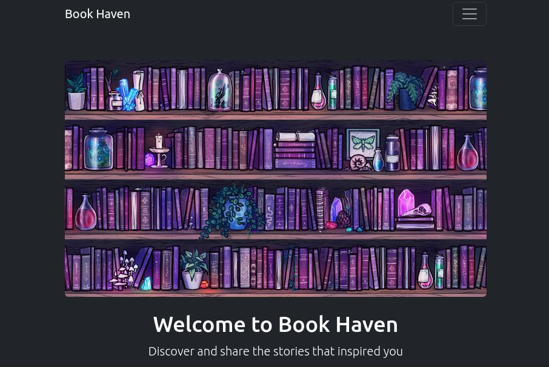
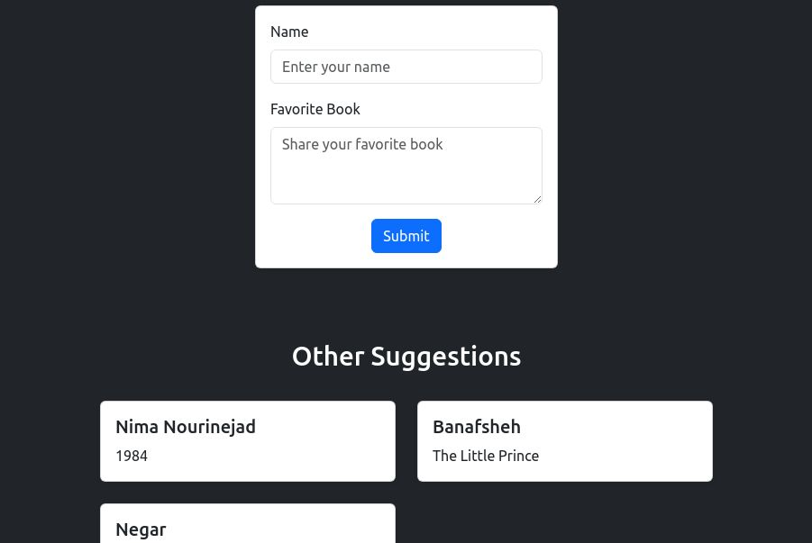

# Book Haven

**Book Haven** is a web application where book lovers can share and explore their favorite book recommendations. Users can submit their favorite books along with their names, and browse through suggestions from others. It's a platform designed to help readers discover new books, exchange ideas, and share what inspires them.

---

## Screenshots

Here are some screenshots of the app:

---

## Features

- **Submit your favorite book:** Users can enter their name and their favorite book, which will then be shared with the community.
- **View others' suggestions:** Users can explore a list of books recommended by other users.
- **Responsive UI:** The application is designed to be fully responsive and provides a seamless experience across all devices.
- **Instant feedback:** After submitting a suggestion, users get immediate success or error messages.
  
---

## Technologies Used

- **Frontend:**
  - React.js: For building the user interface
  - Bootstrap: For responsive design and styling
  - Axios: For making HTTP requests to interact with the backend API

- **Backend:**
  - Node.js with Express: For building the REST API
  - MongoDB: For storing the book suggestions in a cloud database

- **Hosting:**
  - **Frontend:** Hosted on GitHub Pages at [https://nima-nourinejad.github.io/Book-Club/](https://nima-nourinejad.github.io/Book-Club/)
  - **Backend:** Hosted on Render at [https://book-club-backend.onrender.com/](https://book-club-backend.onrender.com/)

---

## Usage

1. Visit the app in your browser at [https://nima-nourinejad.github.io/Book-Club/](https://nima-nourinejad.github.io/Book-Club/).
2. In the **"Your Favorite"** section, enter your name and the book you love, then click **Submit** to share it with others.
3. In the **"Others' Suggestions"** section, browse through the list of book suggestions submitted by other users.
4. The app will dynamically update whenever a new book suggestion is added.

---

## Deployment

- The **Frontend** of the app is hosted on **GitHub Pages** and can be accessed at:  
  [https://nima-nourinejad.github.io/Book-Club/](https://nima-nourinejad.github.io/Book-Club/)
  
- The **Backend** API is hosted on **Render** and can be reached at:  
  [https://book-club-backend.onrender.com/](https://book-club-backend.onrender.com/)

---

## How to Contribute

We welcome contributions to **Book Haven**. Here's how you can help improve the app:

1. **Fork** the repository.
2. **Create a new branch** for your changes.
3. Implement your changes, following the existing code style.
4. **Submit a pull request** with a clear description of what your changes are.

Please make sure to add tests or documentation where appropriate.

---

## License

This project is licensed under the **Apache License 2.0** - see the [LICENSE](LICENSE) file for details.

---

## Acknowledgments

- Thanks to **Bootstrap** for the responsive UI components.
- Thanks to **MongoDB** for the database solution.
- Thanks to **GitHub Pages** for the free frontend hosting.
- Thanks to **Render** for the backend hosting.
